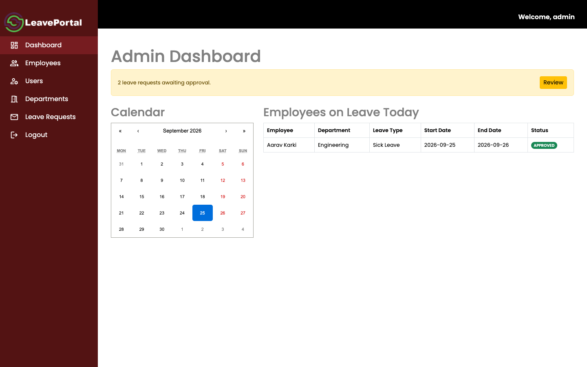
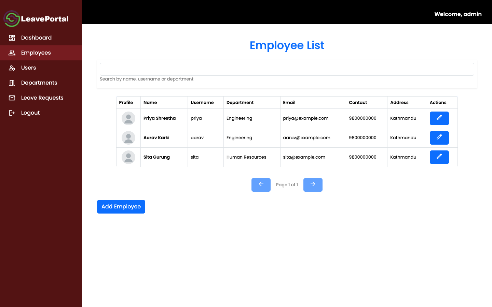
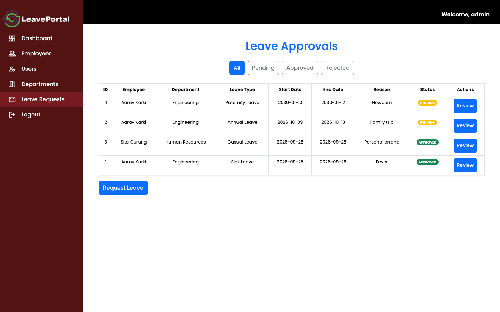
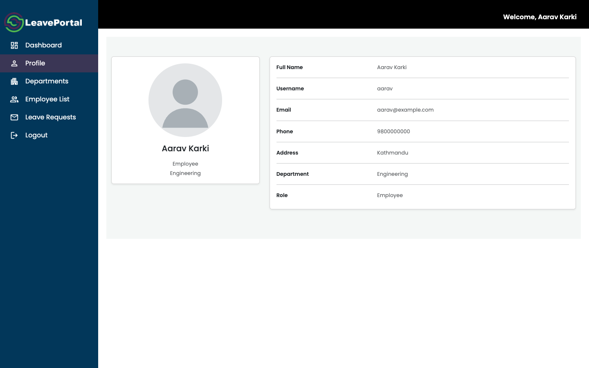

# HRIS: Human Resource Information System

A full-stack HR portal for managing employees, departments, and leave requests. It's built with a **Django REST Framework** API and a **React (Vite)** frontend, and was developed as an internship project.

HR admins register employees, organise departments, and approve or reject leave. Employees can view their profile, browse the company directory, and request and track their own leave.



## Features

**HR admins**
- Dashboard showing pending approvals and who is on leave on any date picked in the calendar
- Employee registration through a step-by-step form, with profile picture upload
- Editing employee details and department assignment
- User account management: roles, email, password resets, deletion
- Department management with an optional manager for each department
- Leave approval queue, filterable by status

**Employees**
- Personal dashboard with leave counts and upcoming leave
- Profile page
- Company directory and department list (read-only)
- Leave requests: submit new ones, and edit them while they're still pending

**Under the hood**
- JWT authentication. The token carries the user's role, so the UI can route admins and employees to different areas.
- Permissions are enforced on the server: only HR admins can write HR data, and employees can only touch their own leave requests
- Server-side validation, e.g. a leave's end date can't be before its start date
- API test suite covering the main permission rules
- One-command Docker deployment (nginx + gunicorn)

## Screenshots

| Employee directory | Leave approvals | Employee profile |
| --- | --- | --- |
|  |  |  |

## Tech stack

| Layer | Tools |
| --- | --- |
| Backend | Python 3.12, Django 5.1, Django REST Framework, SimpleJWT, SQLite |
| Frontend | React 18, Vite, React Router, Axios, MDB React UI Kit, MUI, Bootstrap |
| Deployment | Docker, Docker Compose, gunicorn, nginx |

## Architecture

```
            ┌──────────────────────────── frontend container ───┐
Browser ──▶ │ nginx :80                                         │
            │  ├─ /              → React build (SPA)            │
            │  ├─ /api/v1/media/ → uploaded images (volume)     │
            │  ├─ /static/       → Django admin assets (volume) │
            │  └─ /api/, /admin/ → proxy ─────────┐             │
            └─────────────────────────────────────┼─────────────┘
                                                  ▼
            ┌──────────────── backend container ────────────────┐
            │ gunicorn → Django REST API  ── SQLite (volume)    │
            └───────────────────────────────────────────────────┘
```

The browser only ever talks to one origin, so no CORS setup is needed. The Vite dev server does the same thing in development by proxying `/api` to Django.

## Quick start (Docker)

Requires Docker with Compose v2.

```bash
git clone git@github.com:Sagunnn/HRIS-Internship.git
cd HRIS-Internship
cp .env.example .env        # then set DJANGO_SECRET_KEY and DJANGO_ADMIN_PASSWORD
docker compose up -d --build
```

Open <http://localhost:8080> and sign in with the `DJANGO_ADMIN_USERNAME` / `DJANGO_ADMIN_PASSWORD` from your `.env`. That admin account is created on first start. The Django admin site is at <http://localhost:8080/admin/>.

The database, uploaded images, and static files live in named Docker volumes, so they survive restarts. `docker compose down -v` wipes them.

## Local development

**Backend** (Python 3.12 recommended):

```bash
cd backend
python -m venv venv
source venv/bin/activate          # Windows: venv\Scripts\activate
pip install -r requirements.txt
python manage.py migrate
python manage.py create_admin --username admin --email admin@example.com --password <password>
python manage.py runserver        # http://127.0.0.1:8000
```

**Frontend** (Node 20+), in a second terminal:

```bash
cd frontend
npm install
npm run dev                       # http://localhost:5173
```

Vite forwards `/api/*` to `http://127.0.0.1:8000`. If Django runs somewhere else, set `VITE_PROXY_TARGET`.

### First steps in the app

1. Log in as the admin.
2. **Departments → Create Department** (e.g. `ENG` / Engineering).
3. **Employees → Add Employee** to create accounts. Pick the `Manager` role for anyone who should be selectable as a department manager.
4. Log in as an employee to request leave, then approve it as the admin from **Leave Requests**.

## Configuration

The backend reads its settings from environment variables. The defaults are meant for local development.

| Variable | Default | Purpose |
| --- | --- | --- |
| `DJANGO_SECRET_KEY` | insecure dev key | **Must** be set in production |
| `DJANGO_DEBUG` | `True` (`False` in Docker) | Debug mode |
| `DJANGO_ALLOWED_HOSTS` | `localhost,127.0.0.1` | Comma-separated hostnames |
| `DJANGO_CSRF_TRUSTED_ORIGINS` | *(empty)* | Origins allowed to post to the Django admin, e.g. `http://localhost:8080` |
| `DJANGO_CORS_ALLOWED_ORIGINS` | Vite dev origins | Only needed if the frontend is served from another origin |
| `DJANGO_DB_PATH` | `backend/db.sqlite3` | SQLite file location |
| `DJANGO_MEDIA_ROOT` / `DJANGO_STATIC_ROOT` | `backend/media` / `backend/staticfiles` | Upload and static file locations |
| `DJANGO_ADMIN_USERNAME` / `_EMAIL` / `_PASSWORD` | *(unset)* | First admin, created by `manage.py create_admin` |
| `VITE_API_BASE_URL` | `/api/v1` | Frontend build-time API base URL |
| `HRIS_PORT` | `8080` | Host port used by Docker Compose |

## Roles and permissions

A user counts as an **HR admin** if they have the `Admin` role or Django's `is_staff` flag. Everyone else signs in to the employee area.

| Resource | HR admin | Employee |
| --- | --- | --- |
| Users | full access | view / edit own account (can't change own role) |
| Employees | full access | read-only directory, own profile via `/me/` |
| Departments | full access | read-only |
| Leave requests | view all, approve / reject | create, view, and edit own *pending* requests |

## API overview

All endpoints are under `/api/v1/` and require `Authorization: Bearer <access token>` unless noted.

| Method | Endpoint | Description |
| --- | --- | --- |
| POST | `/token/` | Log in (no auth required). Returns `access` and `refresh` tokens |
| POST | `/token/refresh/` | Exchange a refresh token for a new access token |
| GET, PATCH, DELETE | `/users/`, `/users/{id}/` | User accounts |
| POST | `/register-employee/` | Register an employee and their user account (multipart, admin only) |
| GET, PATCH, DELETE | `/register-employee/list/`, `/register-employee/list/{id}/` | Employees |
| GET | `/register-employee/list/me/` | The current user's employee profile |
| GET, POST, PATCH, DELETE | `/departments/`, `/departments/{department_id}/` | Departments |
| GET, POST | `/leaves/user-leaves/` | The current user's leave requests |
| PATCH | `/leaves/user-leaves/update/{id}/` | Edit own pending leave request |
| GET, PATCH | `/leaves/leave-approval/`, `/leaves/leave-approval/{id}/` | All leave requests; set `status` (admin only) |

Leave types: `SICK`, `CASUAL`, `ANNUAL`, `MATERNITY`, `PATERNITY`, `UNPAID`. Statuses: `PENDING`, `APPROVED`, `REJECTED`, `CANCELLED`.

## Tests and linting

```bash
cd backend && python manage.py test     # API permission & validation tests
cd frontend && npm run lint && npm run build
```

## Project structure

```
backend/
  backend/          Django settings and root URLs
  api/              Users, auth token, shared permissions, API tests
  authentication/   Custom User model (roles) and the create_admin command
  employees/        Employee profiles
  departments/      Departments
  leaves/           Leave requests and approvals
  attendance/       Attendance model (work in progress, not installed yet)
frontend/
  src/services/     API client and one module per resource
  src/components/   Pages, modals and navigation (Admin/ and Employee/ areas)
docker-compose.yml  Two-container production setup
```

## Known limitations and ideas

- Attendance tracking is only sketched out (`backend/attendance`).
- JWTs live in `localStorage`, access tokens last 30 days, and the frontend doesn't use refresh tokens yet.
- SQLite is fine for a small team. Switching to PostgreSQL would only need a `DATABASES` change.
- There's no leave balance or entitlement tracking yet.
